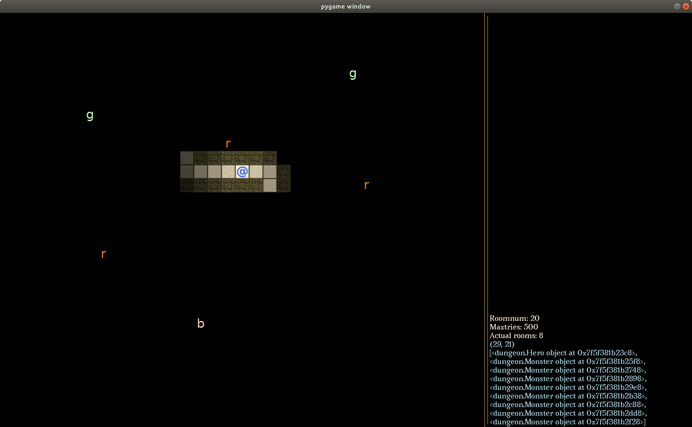
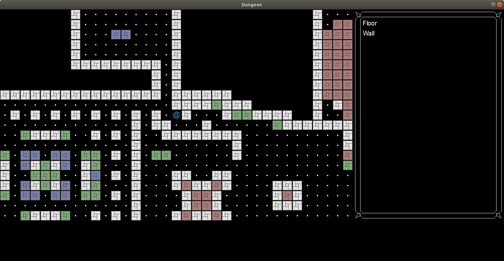

# Dungeon
A top down 2D tile-based roguelike game written in C and python using SDL2 and pygame respectively.
The purpose is mainly to improve my own coding skills and teach myself more about a lot of cool algorithms while making something fun in the process.

The project is thus far split in two. The python part is currently used to explore and experiment with the architecture. Python is fast when you just want to test an algorithm or a design pattern. After testing things in python, the valuable insights gained can then be incorporated into the - hopefully - more "proper" C-version which is more of a game than a mashup of algorithms.  

## Current work and problems
This is a general list of the things that I'm currently working on, should you have any tips or wanted to contribute.
* The FOV-algorithm in the python version sometimes "leaks" through none see-through walls. Don't know why.
* Have implemented the basic turn-based game loop inspired by Angband. Speed is derived from each actors(monster or player) and the time an action takes. I sort of want to have Actions as separate objects, so they don't need to be attached to every monster class or the player class.
* I also need to figure out if I've used the state-machine design pattern correctly with the main menu/game. 
## Next up
When all the above are fixed, what then?
* Look at actual physics and simple AI for the monsters. It could be as simple as:
```if the player is visible:
    walk towards player
else:
    walk in a random direction
```

# Getting Started
Copy the project folder or clone it.

### Prerequisites
So far, it only runs/compiles in linux. A future version might feature Windows or Mac support, but it's not high on my priority-list.

#### dungeon generator in python
python3.6
pygame for linux and python3

Run with:
python3 statemanager.py
Example:
### Screenshot using above example


#### basic game engine in C
SDL2 SDL_image and SDL_ttf libraries. All are to be found in standard linux repo.

Compile with:
make
Run with:
./dungeon <optional width> <optional height>
or
make run
Example:
```./dungeon 1000 500```
### Screenshot using above example

To play/test:
Keypads or arrows to move around
Level is a hardcoded for display-testing purposes. No mechanics implemented. But a hardcoded alpha in the middle of the map-view. 

## Built With
* [SDL2](https://www.libsdl.org/download-2.0.php) - Simple Direct Media Layer
* [pygame](http://www.pygame.org) - For quick and easy graphics
* [python3](https://www.python.org/download/releases/3.0/) - For quick and easy code
* [C](https://en.wikipedia.org/wiki/C_(programming_language)) - For more learning and control

## Authors
* **Raymon Skjørten Hansen** - *Initial work* - [Raymon on Github](https://github.com/raymonshansen)

## Contributors
* **Isak Sunde Singh** - *Tips and help* - [Isak on Github](https://github.com/IsakSundeSingh)
* **Mads Johansen** - *Tips and help* - [Mads on Github](https://github.com/MaxJohansen)

## Acknowledgments
* Thomas Biskups [Ancient Domains of Mystery](wwww.adom.de)
* Jamis Bucks Growing Tree Algorithm [Jamis Bucks Blog](http://weblog.jamisbuck.org/2011/1/27/maze-generation-growing-tree-algorithm)