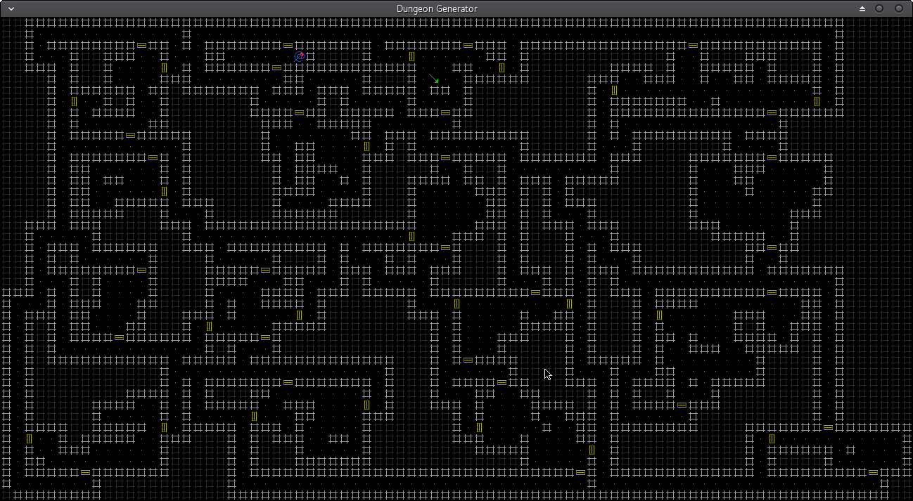

# Dungeon

This is a random dungeon generator. It is a personal pet-project whose long term goals MIGHT end up in a roguelike game. For now, it is mainly an exploration of different ways of randomly generating the basic layout of a classic dungeon(rooms and corridors). It is not intended to be playable, although it sort of is. 

## Getting Started

Copy the project folder or clone it.

### Prerequisites

python3.6
pygame for linux and python3

Run with:
python3 dungeon.py <width in pixels> <height in pixels> <recursive depth>
Example:
```
python3 dungeon.py 1300 700 4
```

### Screenshot using above example


## Testing
To play:
"L" resets all lists and spawns a new level
Keypad numbers 1-9 moves the blue "@" around

Upon reaching the green arrow going down, a new level is spawned.


## Built With

* [pygame](http://www.pygame.org) - For quic and easy graphics
* [python3](https://www.python.org/download/releases/3.0/) - For quick and easy code

## Authors

* **Raymon Skjørten Hansen** - *Initial work* - [Raymon on Github](https://github.com/raymonshansen)

## Acknowledgments

* Thomas Biskups [Ancient Domains of Mystery](wwww.adom.de)
* Jamis Bucks Growing Tree Algorithm [Jamis Bucks Blog](http://weblog.jamisbuck.org/2011/1/27/maze-generation-growing-tree-algorithm)
